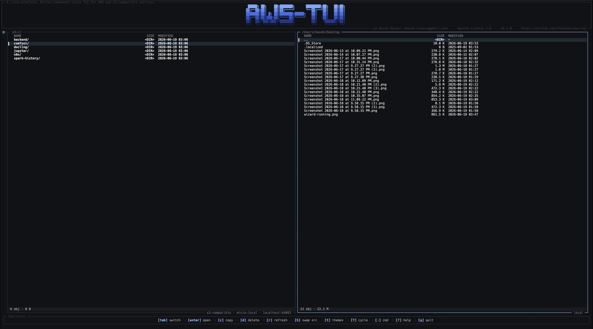

# 1. aws-tui

<p align="center">
  
</p>

Cross-platform TUI for AWS and S3-compatible services — runs on macOS,
Linux, and Windows. Powered by
[Textual](https://textual.textualize.io/) and the
[VMx](https://github.com/thekaveh/VMx) MVVM framework.

> **Status: v0.8.0 cut; PyPI publish pending** — install from Git
> until the `aws-tui` project name is available on PyPI. Headline
> change from v0.7.0: **EMR Serverless as a
> second first-class service** alongside S3 — application picker,
> job-runs master-detail with state-filter chips, columnized run
> rows with colored state indicators, on-demand log streaming with
> a grep filter + LRU cache, clone-and-edit modal for re-running
> a finished job, and a 4-slot Tab cycle through NavMenu → LEFT →
> DETAIL → LOGS. The nav rail is now a regular focusable pane
> with text labels (no collapse mode, no icon emojis). See
> [`CHANGELOG.md`](CHANGELOG.md) for the full per-PR delta.

## 1.1. Features

- **Norton-Commander–style dual pane.** S3 (or any S3-compatible bucket)
  on one side, your local filesystem on the other. Copy and delete
  across panes with `c` and `d` (confirm modal first); multi-select via
  `Shift+↑/↓` cursor extension, modifier+click, or persistent marks.
  The left-rail nav menu is always visible — Tab cycles in/out of it
  as a regular pane (post-PR-#94). Move, rename, and the dedicated
  `v` multi-select-mode entry point are spec'd but deferred to v0.9 —
  see [`docs/keybindings.md` file operations](docs/keybindings.md#113-file-operations)
  and [action IDs](docs/keybindings.md#13-action-ids), plus the
  `Deferred / v0.9 roadmap` block in the `[0.8.0]` section of
  `CHANGELOG.md`.
- **One-key source switcher.** `Shift+S` cycles the focused pane
  through **every available source** in order: `local` → each AWS
  profile (`aws s3 · {profile} · {region}`) → each `s3-compatible`
  connection (`s3-compatible · {name} · {endpoint}`) → wrap. With
  multiple AWS profiles configured locally, this is the fastest way
  to jump between accounts: one keystroke per profile, the pane
  re-mounts in place — no `:` command palette, no modal. The
  s3-compatible side is open-ended: add as many MinIO / R2 / B2 /
  Wasabi / Ceph endpoints as you like via the in-app **Settings**
  nav page (or by hand in `<config-dir>/config.toml`) and they
  join the cycle automatically. The four combos `{S3, local} ×
  {S3, local}` are reachable per pane independently.
- **First-class S3-compatible support.** MinIO, Cloudflare R2,
  Backblaze B2, Wasabi, Ceph, SeaweedFS — same code path as native
  AWS. Path-style addressing toggle and per-vendor docs.
- **EMR Serverless (read-only browser + clone-job-run).** Second
  shipped service, alongside S3. Pick the **EMR** nav row to
  browse applications, drive a master-detail Job Runs pane with
  state-filter chips, inspect job-run details (driver, spark
  params, execution duration) — all driven by three independent
  pollers (apps 60 s / runs 60 s with 6:1 decay when no active
  runs / detail 30 s with terminal-state suppression — demo mode
  bumps to 30 s / 30 s / 5 s so the clone-state walk stays
  visible). Press `c`
  on a finished job run to open a clone-and-edit modal that
  pre-fills every field from the source run and fires
  ``start_job_run`` on save (PR #83 — landed ahead of the rest
  of PR-C). Job-run logs are streamable on demand; cancel and the
  vanilla submit form remain deferred. AWS-only (does not surface
  for s3-compatible connections).
- **Silent SSO.** Auto-discovers every AWS profile from
  `~/.aws/{config,credentials}`. SSO-backed profiles get a cheap
  token-cache freshness probe on launch (one `stat`, one ~1 KB JSON
  read, sub-millisecond); non-SSO profiles go straight to live boto
  credential-chain validation.
  Honors `$AWS_PROFILE` between `[defaults].connection` and the
  first-auto fallback so SSO setups where `[default]` has no creds
  still pick the right profile.
- **Crash-recovery transfer journal.** Transfers leave durable
  begin/finished/aborted journal records under
  `<cache-dir>/transfers/<id>.jsonl`. Startup resume and true
  multipart-upload replay/abort remain deferred in v0.8.x.
- **Crash dump.** Unhandled exceptions write a dump to
  `<cache-dir>/crash/<ts>.txt` (traceback, last user actions, and log
  tail). The interactive recovery modal remains deferred in v0.8.x.
- **Transfers overlay.** Top-right floating box: one row per active
  transfer with src → dst label, progress bar, and cancel button.
  Finished entries linger briefly then disappear so newer transfers
  take their place.
- **Ten built-in themes.** Four dark originals — Carbon (default),
  Voidline (neon), Lattice (mint), Amber CRT (retro) — plus three
  light themes (Solarized Light, GitHub Light, One Light) and three
  popular community palettes (Nord, Dracula, Gruvbox Dark). Each drives a matching
  banner gradient at launch and on every `T` cycle. User overrides
  via `<config-dir>/theme.tcss` or full `.tcss` themes under
  `<config-dir>/themes/`.
- **In-app S3 connection settings.** The left rail's `⚙ Settings`
  nav peer opens a scrollable settings page (no modal overlay) with
  a Connections section that lists every configured s3-compatible
  endpoint and an inline form for add/edit (Save commits + reloads
  affected panes immediately; Delete prompts for confirmation).
  Keyboard: `,` selects Settings. No more hand-editing
  `<config-dir>/config.toml` for routine endpoint changes.
- **Keymap schema ready; runtime rebinding deferred.** Action ↔
  keystroke IDs are defined and validated, but `AwsTuiApp` still routes
  the wired v0.8.x bindings directly. See
  [`docs/keybindings.md` customizing](docs/keybindings.md#12-customizing)
  and [action IDs](docs/keybindings.md#13-action-ids) for the current
  wired list and the v0.9 input-router plan.
- **Streaming Quick Look (deferred).** Spec'd on `Space` to stream the
  first 64 KB with a syntax tint, plus a full-file `$PAGER` shell-out.
  The `pane.quick_look` action handler isn't wired in v0.8.x — tracked
  under `[Unreleased] Deferred` in `CHANGELOG.md` and
  [`docs/keybindings.md` overlays](docs/keybindings.md#114-overlays).
- **Command palette (deferred).** Spec'd on `:` or `Ctrl+K` as a
  fuzzy-filterable list of every action — including dynamic ones like
  `connection switch <name>` and `theme switch <name>`. In v0.8.x `:`
  opens the help overlay as a placeholder and `Ctrl+K` is unbound; the
  full palette ships post-v0.8. See `[Unreleased] Deferred` in
  `CHANGELOG.md` and [`keybindings.md` overlays](docs/keybindings.md#114-overlays).
- **Layered architecture with enforced forbidden edges.** View ▸ ViewModel
  ▸ Service ▸ Domain ▸ Infra, with `app.py` / `composition.py` as trusted
  composition roots and services allowed to compose concrete VMs; enforced
  by `scripts/check-layers.sh`. Mypy strict-clean.
  See [`docs/architecture.md` testing pyramid](docs/architecture.md#15-testing-pyramid)
  for the current test-tier table; the default tier runs unit / in-process integration /
  snapshot / e2e, with a 9-test MinIO tier opt-in via
  `uv run pytest -m integration`.

## 1.2. Install

> **PyPI release of `aws-tui` is in flight** — the VMx PyPI blocker has
> lifted (the framework now ships on PyPI). Until aws-tui's own first
> PyPI release lands, install from Git:

```bash
pipx install git+https://github.com/thekaveh/aws-tui.git
```

For development:

```bash
git clone https://github.com/thekaveh/aws-tui.git
cd aws-tui
uv sync --frozen --dev
uv run aws-tui
```

Requirements: Python 3.11 / 3.12 / 3.13 and a current `uv` that can
read lockfile revision 3 (CI uses `astral-sh/setup-uv@v7`). Runs on
macOS, Linux, and Windows — see [`docs/platforms.md`](docs/platforms.md)
for the recommended terminal + font setup per OS.

### 1.2.1. Try it without AWS credentials

Pass `AWS_TUI_DEMO=1` (or `--demo`) to launch with deterministic mock data backing all services:

```sh
AWS_TUI_DEMO=1 aws-tui
# or
aws-tui --demo
```

You'll see four synthetic connections (`demo-dev`, `demo-prod`, `demo-shared`, `demo-minio`), populated S3 buckets, EMR Serverless applications and job runs across multiple states, and working clone / copy / delete operations. AWS/S3/EMR demo state resets every launch; the local pane is your real filesystem. A persistent **DEMO MODE** chip in the banner subtitle keeps the no-real-AWS contract obvious.

To verify: `aws-tui --version` reports `(demo: enabled)` or `(demo: disabled)`.

## 1.3. Quickstart

```bash
aws-tui                       # launches with the default connection
```

For SSO-backed profiles, if you've run `aws sso login --profile <name>`
recently, aws-tui picks up the cached token silently (no network
round-trip just to render the UI). Otherwise the picker shows the
connection in `login needed` state — the `auth.authenticate` action is
spec'd as `a` in
[`docs/keybindings.md` connection/auth](docs/keybindings.md#116-connection-auth) but its
runtime wiring is deferred to v0.9 (the `BindingResolver`
work — see the `Deferred / v0.9 roadmap` block in `CHANGELOG.md`).
Today, run `aws sso login --profile <name>` in your shell and
relaunch. Non-SSO profiles are attempted directly through boto3; debug
shared credentials, `credential_process`, env, or role-backed profiles
with `aws sts get-caller-identity --profile <name>`.

If `aws s3 ls` works on your shell but `aws-tui` shows
`access denied` on the left pane, the most common cause is that
`[default]` in `~/.aws/config` has no creds. Export `$AWS_PROFILE`
pointing at the working profile and relaunch — the resolver picks it
up between `[defaults].connection` and the first-auto fallback.

### 1.3.1. First-time launch

If you have **no** `[connections.*]` in `<config-dir>/config.toml`
**and** `~/.aws/{config,credentials}` is empty, v0.8.x opens the main
screen with a local-only placeholder. A welcome modal exists in the UI
surface but is not wired into startup yet (tracked for v0.9):

```
welcome to aws-tui
no AWS or S3-compatible connections configured.
  add aws profile  (runs 'aws configure sso' in your terminal)
  add s3-compatible (in-TUI form for MinIO, R2, etc.)
  skip for now (you can add later from Settings)
```

For now, add an AWS profile with `aws configure sso` / `aws sso login`,
or open Settings with `,` and add an S3-compatible connection.

## 1.4. Documentation

Numbered hierarchically for navigation.

1. **User-facing**
   1. [Connections (AWS profiles + S3-compatible)](docs/connections.md) — configure connections; how the credential chain resolves; vendor quirks for MinIO / R2 / B2 / Wasabi.
   2. [Keybindings](docs/keybindings.md) — wired key map, deferred action IDs, and the pending `[keybindings]` overlay contract.
   3. [Theming](docs/theming.md) — built-in palettes, runtime theme switch, `.tcss` overlay and custom-theme drop-ins.
   4. [Cookbook (common recipes)](docs/cookbook.md) — step-by-step walkthroughs (connect to MinIO, switch theme on the fly, prepare keybinding overlays, resume after a crash).
   5. [Supported platforms](docs/platforms.md) — per-OS terminal + font recommendations and Windows launch notes.
   6. [Local AWS test-services harness (`scripts/test-services/`)](scripts/test-services/README.md) — MinIO Docker Compose + seed for offline development.
2. **Contributor-facing**
   1. [Architecture](docs/architecture.md) — five-layer model + composition root + lifecycle + messaging primer.
   2. [Adding a new service](docs/adding-a-service.md) — the `Service` protocol + per-layer wiring.
   3. [VMx Python cheatsheet](docs/superpowers/notes/2026-06-14-vmx-python-cheatsheet.md) — facade pattern, message-protocol shape, lifecycle gotchas.
3. **Spec + plans**

   Historical superpowers specs, plans, and notes are indexed here for
   provenance; headings are numbered for repository-wide navigation.
   1. [v0.1.0 design spec](docs/superpowers/specs/2026-06-13-aws-tui-design.md) — authoritative source for behavior + acceptance.
   2. [Settings as a first-class nav page](docs/superpowers/specs/2026-06-20-settings-as-first-class-nav-page-design.md) — design + post-ship amendments (PR #54 / #55 / #56). Supersedes the modal-overlay design at [`docs/superpowers/specs/2026-06-20-app-settings-shell-and-s3-panel-design.md`](docs/superpowers/specs/2026-06-20-app-settings-shell-and-s3-panel-design.md) (kept for git-history continuity, marked SUPERSEDED in-file).
   3. [Modal & toast polish](docs/superpowers/specs/2026-06-19-modal-toast-polish-design.md) — PR #47 modal/toast surface rework.
   4. [Graceful unreachable connections](docs/superpowers/specs/2026-06-19-graceful-unreachable-connections.md) — PR #48/#49 design.
   5. [EMR Serverless service v1 design](docs/superpowers/specs/2026-06-25-emr-serverless-service-design.md) — decomposed PR-A read-only browser, PR-B cancel + logs, PR-C submit (vanilla + clone), PR-D E2E. Shipped through PRs #76–#84 for the read-only browser, clone-job-run modal, and logs pane/filter work; cancel and vanilla submit remain deferred in the spec's "Status" note.
   6. [Public release pipeline](docs/superpowers/specs/2026-06-27-public-release-pipeline-design.md) — `release.yml` build + Sigstore-signed PyPI publish + Homebrew tap bump, design landing alongside the v0.8.0 cut (PR #95).
   7. [Cross-platform readiness](docs/superpowers/specs/2026-06-28-cross-platform-readiness-design.md) — macOS / Linux / Windows parity audit and the install / smoke / docs plan for matching all three.
   8. [Demo mode](docs/superpowers/specs/2026-06-28-demo-mode-design.md) — `AWS_TUI_DEMO=1` (or `--demo`) boots the full UI against seeded in-memory fakes; ships in PRs #97 / #104.
   9. [VMx toolkit adoption](docs/superpowers/specs/2026-06-28-vmx-toolkit-adoption-design.md) — case-by-case retrofit of the VM layer to use VMx 2.6.1's existing `CompositeVM` / `FormVM` / `IDialogService` toolkit instead of the hand-rolled patterns the project currently ships. Records the analytical mistakes the design review went through (§1.3) so the next worker doesn't repeat them. Awaiting brainstorm → plan → execution.
   10. [VMx vNext upstream asks](docs/superpowers/specs/2026-06-28-vmx-upstream-vnext-asks.md) — feedback report for VMx maintainers, derived from the aws-tui toolkit-adoption review and focused on primitives that would reduce custom wrapper code.
   11. [Implementation plans (M0–M6 and post-tag specs)](docs/superpowers/plans/) — per-milestone breakdowns + per-spec implementation plans; superseded plans (e.g. PR #52 modal-overlay) are kept in-tree but marked.
4. **Maintainer-facing**
   1. [Recording todo](docs/recording-todo.md) — asciinema + screenshot artifacts the maintainer still needs to record manually.
   2. [Release procedure](docs/RELEASING.md) — cut-a-release checklist: version bump, CHANGELOG, tag, publish, Homebrew bump.
   3. [Homebrew bootstrap](docs/homebrew-bootstrap.md) — one-shot bootstrap for the `thekaveh/homebrew-aws-tui` tap immediately after the first PyPI release. After that, the bump-homebrew job in `release.yml` opens PRs against the tap automatically.
   4. [Consumed contract ledger](docs/contract-ledger.md) — pinned external API/tooling contracts checked during maintenance passes.
5. **Project meta**
   1. [Contributing](CONTRIBUTING.md) — development setup and commit conventions.
   2. [Code of Conduct](CODE_OF_CONDUCT.md) — contributor behavior expectations and enforcement.
   3. [Security policy](SECURITY.md) — vulnerability reporting + supported versions.
   4. [Changelog](CHANGELOG.md) — per-pass + per-release deltas.

## 1.5. File locations

`<config-dir>` and `<cache-dir>` are platform-specific; see
[`docs/platforms.md`](docs/platforms.md#11-quick-reference) for exact
macOS, Linux, and Windows paths. Existing legacy XDG directories are
preserved when present.

| Path | Contents |
|---|---|
| `<config-dir>/config.toml` | Connections + defaults + keybindings |
| `<config-dir>/theme.tcss` | Optional `.tcss` overlay over the active theme |
| `<config-dir>/themes/<name>.tcss` | Optional full custom themes |
| `<cache-dir>/log/aws-tui.log` | JSON-lines log (rotated 5 MB × 5) |
| `<cache-dir>/transfers/<id>.jsonl` | Per-transfer crash-recovery journal |
| `<cache-dir>/crash/<ts>.txt` | Full traceback + log/action tail per crash |

## 1.6. Environment variables

| Variable | Default | Effect |
|---|---|---|
| `AWS_PROFILE` | unset | Pick this AWS profile at launch when `[defaults].connection` is unset. Honored between config and first-auto-discovered fallback. |
| `AWS_DEFAULT_REGION` | unset | Used only by AWS tooling outside aws-tui; aws-tui resolves connection regions from `[connections.*].region`, AWS profile config, or `us-east-1`. |
| `AWS_REGION` | unset | Same caveat as `AWS_DEFAULT_REGION`: set a profile/config region for aws-tui connection selection. |
| `AWS_TUI_DEMO` | unset | Truthy values `1`, `true`, and `yes` launch demo mode with seeded in-memory data. Equivalent to `aws-tui --demo`. |
| `${PREFIX}_ACCESS_KEY_ID` / `${PREFIX}_SECRET_ACCESS_KEY` / optional `${PREFIX}_SESSION_TOKEN` | per-connection | Read by `ConnectionResolver` when a `[connections.<name>]` entry in `config.toml` sets `credentials = "env:PREFIX_"`. See [`docs/connections.md`](docs/connections.md) for the full pattern. |
| `XDG_CONFIG_HOME` | per-OS default | Linux: used by `platformdirs` when no legacy `~/.config/aws-tui` directory already exists. macOS and Windows use the platform-native location regardless. |
| `XDG_CACHE_HOME` | per-OS default | Linux: used by `platformdirs` when no legacy `~/.cache/aws-tui` directory already exists. macOS and Windows use the platform-native location regardless. |
| `AWS_TUI_TRANSFER_LINGER` | `3.0` | Seconds a finished transfer's row stays visible in the transfers overlay before it fades. Test-only knob — short values make `pytest` runs faster. |

Any `$PAGER` / `$EDITOR` semantics during the AWS-CLI shell-out for
SSO setup follow the AWS CLI's own conventions; aws-tui itself does
not read those variables in v0.8.x. The Quick Look full-file `$PAGER`
shell-out is spec'd but not yet wired (see the
`[Unreleased] Deferred` block of `CHANGELOG.md`).

## 1.7. Localization

aws-tui is English-only in v0.8.x. User-facing strings are intentionally
hardcoded until a localization pass introduces translation bundles and
locale-aware formatting.

## 1.8. Contributing

See [CONTRIBUTING.md](CONTRIBUTING.md). License:
[Apache License 2.0](LICENSE) (with [NOTICE](NOTICE)). Security:
see [SECURITY.md](SECURITY.md).
