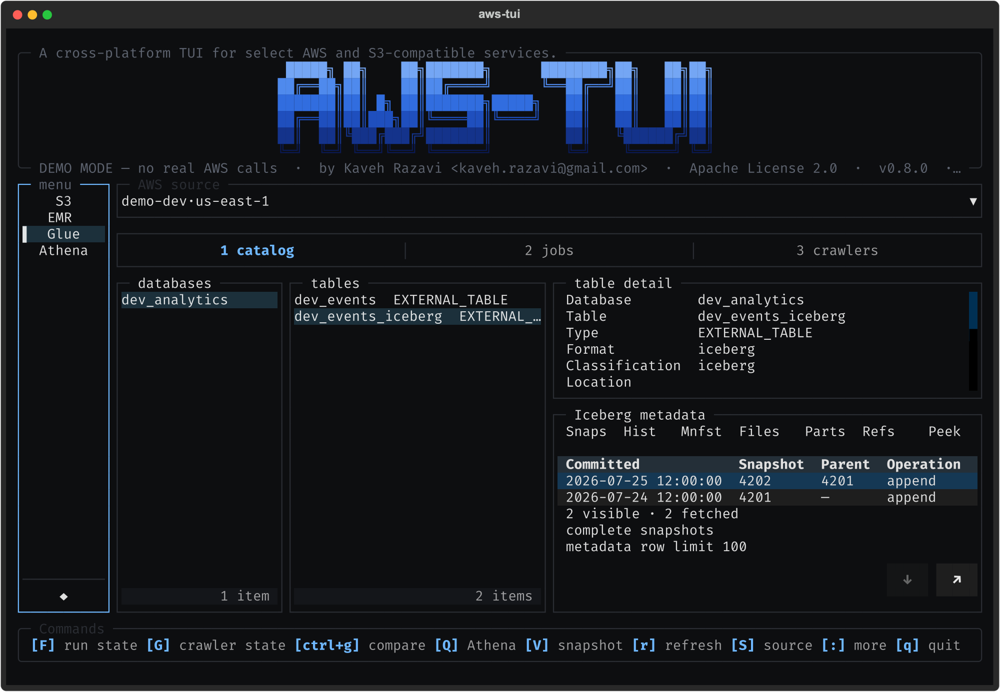

# aws-tui

<p align="center">
  
</p>

<p align="center">
  
</p>

<p align="center">
  
  
  
  
</p>

Cross-platform TUI for AWS and S3-compatible services — runs on macOS,
Linux, and Windows. Powered by
[Textual](https://textual.textualize.io/) and the
[VMx](https://github.com/thekaveh/VMx) MVVM framework.

aws-tui provides a dual-pane file manager for S3 and S3-compatible storage,
an EMR Serverless console, and read-only consoles for AWS Glue and Amazon Athena.
Glue tables generate Athena starter queries. Athena results can open their S3
artifacts, and both services expose Iceberg metadata. The interface supports
keyboard navigation throughout these services.

Destructive operations require confirmation. Transfers and service reads run in
cancellable workers. `Shift+S` changes the focused S3 pane's source. In EMR,
Glue, and Athena, it changes the active service's AWS connection.

> **Status: v0.9.0 development; no package release published** — install from Git
> until the `aws-tui` project name is available on PyPI. Glue, Athena, and
> their integrated Iceberg workflows are Unreleased v0.9.0 feature work. The
> package metadata remains `0.8.0` until the release-preparation PR bumps it;
> the current tree must not be tagged as v0.8.0. See
> [`CHANGELOG.md`](CHANGELOG.md) for the full per-PR delta.

## 1. Features

- **Norton-Commander–style dual pane.** S3 (or any S3-compatible bucket)
  on one side, your local filesystem on the other. Copy and delete
  across panes with `c` and `d` (confirm modal first); multi-select via
  `Shift+↑/↓` cursor extension, modifier+click, or persistent marks.

  `p` copies the cursor entry's path and `P` the pane's own path; the
  pane's top border is a click target for the same copy.
  The left-rail nav menu is always visible — Tab cycles in/out of it
  as a regular pane.

  The dedicated `v` multi-select-mode entry point is implemented. Move and rename remain deferred to v0.9. See [`docs/keybindings.md` file operations](docs/keybindings.md#13-file-operations) and [action IDs](docs/keybindings.md#3-action-ids). Also see the `Deferred / v0.9 roadmap` block in the `[0.8.0]` section of `CHANGELOG.md`.
- **AWS Glue read-only operations console.** Pick **Glue** in the nav rail. Browse databases, tables, schema/storage detail, partitions, column statistics, jobs and recent runs, and crawler status/detail.
  `1` / `2` / `3` select Catalog / Jobs / Crawlers, `r` refreshes the
  active view.

  The bordered AWS source selector chooses an exact configured
  profile and region; `Shift+S` still cycles in resolver order. Jobs and
  Crawlers expose bordered state selectors through `Shift+F` and `Shift+G`.
  On a selected Catalog table, `y` copies the fully quoted table reference into the VMx-backed app clipboard. It then hands the reference to the OS clipboard through the single app-level writer. The writer's toast names the channel that actually accepted it.

  From a selected Catalog table, the command palette can open its exact
  location in S3. Press `Shift+Q` to open that table in Athena and prefill the
  quoted `SELECT * ... LIMIT 5` statement. Iceberg tables add bounded,
  on-demand Snapshots, History, Manifests, Files, Partitions, and References
  views.

  Select a visible snapshot. Press `Shift+V`, or activate the real arrow button, to open Athena with the same statement plus `FOR VERSION AS OF`. Neither handoff executes the query. Every handoff
  preserves the exact Glue connection name and region; it never substitutes
  another profile.

  A seventh **Peek** tab previews the table's rows without Athena. It reads the S3 location directly with a local DuckDB engine pinned to the selected snapshot. It needs the optional `duckdb` extra (the [Git installation with the DuckDB extra](docs/install.md#2-optional-extras)) and a profile connection. Glue is AWS-only
  and does not appear for S3-compatible connections.
- **Amazon Athena read-only query console.** Pick **Athena** in the nav rail to choose a workgroup, catalog, and database. Submit one allowed read-only statement and follow its lifecycle. Page through Results, inspect History, and open named or prepared queries in the editor.
  Workgroup, catalog, and database are keyboard-focusable selectors opened by
  `Shift+W`, `Shift+C`, and `Shift+D`.

  Press `i` outside the editor, or choose the contextual palette command. This inserts a same-source copied table reference at the editor selection or cursor without executing SQL.
  Athena is AWS-only. The local parser fails closed before dispatch, while AWS
  IAM, Lake Formation, workgroup, and S3 policies remain authoritative.

  The
  Query execution detail shows bytes scanned; History detail shows bytes
  scanned and result reuse. Results contains paged result rows. A successful customer-S3 execution can hand off its concrete result artifact to the matching S3 connection. Athena-managed results have no customer S3 artifact to hand off.

  A query that resolves to one visible table can return to that
  exact table in Glue. Glue table and Iceberg snapshot handoffs prefill
  fully-qualified, bounded SQL in Athena without executing it.
- **One-key source switcher.** `Shift+S` cycles the focused S3 pane
  through **every available source** in resolver order: `local` → explicit
  `[connections.*]` entries → non-colliding auto-discovered AWS profiles →
  wrap. AWS sources render as `aws s3 · {profile} · {region}` and configured
  endpoints as `s3-compatible · {name} · {endpoint}`.

  With multiple AWS profiles configured locally, this is the fastest way to jump between accounts: one keystroke per profile. The pane re-mounts in place — no `:` command palette, no modal. On EMR
  Serverless, Glue, and Athena, the same key switches the whole single-context
  service to the next supported AWS connection.

  The s3-compatible side is open-ended. Add as many MinIO / R2 / B2 / Wasabi / Ceph endpoints as you like via the in-app **Settings** nav page. You can also add them by hand in `<config-dir>/config.toml`. They join the cycle automatically. The four combos `{S3, local} ×
  {S3, local}` are reachable per pane independently.
- **First-class S3-compatible support.** MinIO, Cloudflare R2,
  Backblaze B2, Wasabi, Ceph, SeaweedFS — same code path as native
  AWS. Path-style addressing toggle and per-vendor docs.
- **EMR Serverless (read-only browser + clone-job-run).** Second
  shipped service, alongside S3. Pick the **EMR** nav row to choose an exact AWS profile and region from the bordered source selector. Browse applications and drive a master-detail Job Runs pane with state-filter chips. Inspect job-run details (driver, spark params, execution duration).

  Three independent pollers drive these views. Apps poll every 60 s; runs poll every 60 s with 6:1 decay when no active runs remain. Detail polls every 30 s with terminal-state suppression. Demo mode bumps these intervals to 30 s / 30 s / 5 s so the clone-state walk stays visible.

  Press `c` on a finished job run to open a clone-and-edit modal. The modal pre-fills every field from the source run and fires ``start_job_run`` on save. Job-run logs are streamable on demand.
  Press `x` on an active run to confirm cancellation. The vanilla submit form
  remains deferred.

  AWS-only (does not surface
  for s3-compatible connections). The source and application dropdowns overlay
  the current layout, so opening or closing either picker does not resize the
  runs or detail panes. `Tab` and `Shift+Tab` traverse the source selector,
  application selector, runs, detail, logs, and service rail.
- **Silent SSO.** Auto-discovers every AWS profile from
  `~/.aws/{config,credentials}`. SSO-backed profiles use local AWS config and
  SSO cache reads only; no AWS network call. Non-SSO profiles go straight to
  live boto credential-chain validation.
  Honors `$AWS_DEFAULT_PROFILE` and then `$AWS_PROFILE` between
  `[defaults].connection` and the first-connection fallback so SSO setups where
  `[default]` has no creds still pick the right profile.
- **In-flight transfer journal.** Active transfers write durable `begin`
  records under `<cache-dir>/transfers/<id>.jsonl`; successful, skipped,
  failed, and cancelled transfers remove their terminal journal promptly.
  An entry left by a process crash is diagnostic only today: automatic
  replay and startup cleanup remain deferred.
- **Crash dump.** Unhandled exceptions write a dump to
  `<cache-dir>/crash/<ts>.txt` (traceback, last user actions, and log
  tail). The interactive recovery modal remains deferred in v0.8.x.
- **Transfers overlay.** Top-right floating box: one row per active
  transfer with src → dst label, progress bar, and cancel button.
  Finished entries linger briefly then disappear so newer transfers
  take their place.
- **Ten built-in themes.** Four dark originals — Carbon (default),
  Voidline (neon), Lattice (mint), Amber CRT (retro) — plus three
  light themes (Solarized Light, GitHub Light, One Light) and three
  popular community palettes (Nord, Dracula, Gruvbox Dark). Each drives a matching
  banner gradient at launch and on every `T` cycle. User overrides
  via `<config-dir>/theme.tcss` or full `.tcss` themes under
  `<config-dir>/themes/`.
- **In-app S3 connection settings.** The left rail's `Settings` nav peer opens a scrollable settings page (no modal overlay). Its Connections section lists every configured s3-compatible endpoint and provides an inline form for add/edit. Save commits and reloads affected panes immediately; Delete prompts for confirmation.
  Keyboard: `,` selects Settings. No more hand-editing
  `<config-dir>/config.toml` for routine endpoint changes.
- **Runtime-configurable keymap.** `BindingResolver` installs handled
  `[keybindings]` overrides at runtime, so remapping an action changes
  the live Textual keymap on the next launch. Valid overlays apply on the
  next launch; invalid overlays fall back atomically. Handlerless deferred
  action IDs remain unbound. See
  [`docs/keybindings.md` customizing](docs/keybindings.md#2-customizing)
  and [action IDs](docs/keybindings.md#3-action-ids).
- **Streaming Quick Look.** Press `Space` on a file to open the built-in
  preview modal. CSV, JSON and JSONL show bounded tables; Parquet shows schema
  and up to 50 rows across at most 24 columns. Press `r` to toggle the cached
  raw 64 KiB prefix, and use arrow keys to scroll vertically or horizontally.

  Reads share a five-second budget of 32 requests and 8 MiB; malformed or
  truncated JSON falls back to raw. Directories, the `..` row, and empty panes
  are ignored. See the [preview recipe](docs/cookbook.md#9-preview-files-with-quick-look)
  for Parquet limits and failure messages.

  The full-file `$PAGER` shell-out
  remains deferred.
- **Command palette.** Press `:` or `Ctrl+K` for the fuzzy-filterable curated command list. It includes **Open table location in S3** on Glue and **Open Athena result in S3** for a validated successful Athena execution. Service commands appear only for their active service.

  Dynamic
  `connection switch <name>` / `theme switch <name>`
  entries remain deferred. `Ctrl+P` finds a loaded file entry; `/` edits the
  loaded name filter. **Sort loaded entries** offers six orders in the palette.
  Integrated commands include **Query table in Athena**, **Query Iceberg
  snapshot in Athena**, and **Open query table in Glue**; each preserves the
  active connection name and region.
- **Compact command guidance.** The bottom Commands pane is always one compact
  content row. Click any enabled visible command to invoke the same registered
  action as its shortcut or command-palette entry. Hover a command to see its
  full shortcut, effect, execution or mutation behavior, and any unmet
  prerequisite. At narrow widths, lower-priority hints are hidden
  deterministically while `[:] more` opens the active service's command palette
  and `[q] quit` remains visible.
- **Layered architecture with enforced forbidden edges.** View ▸ ViewModel
  ▸ Service ▸ Domain ▸ Infra, with `app.py` / `composition.py` as trusted
  composition roots and services allowed to compose concrete VMs; enforced
  by `scripts/check-layers.sh`. Mypy strict-clean.
  See [`docs/architecture.md` testing pyramid](docs/architecture.md#5-testing-pyramid) for the current test-tier table. The default tier runs unit / in-process integration / snapshot / e2e. The opt-in S3-compatible S3Mock tier uses `uv run pytest -m integration`.

## 2. Install

> **PyPI status:** no `aws-tui` package is published yet. The v0.9.0 work in
> this repository is development work; install from Git until the first
> PyPI release lands:

```bash
pipx install git+https://github.com/thekaveh/aws-tui.git
```

For development:

```bash
git clone https://github.com/thekaveh/aws-tui.git
cd aws-tui
uv sync --locked --all-groups
uv run aws-tui
```

Requirements: Python 3.11 / 3.12 / 3.13 and a current `uv` that can
read lockfile revision 3 (CI pins `uv==0.11.19`). Runs on
macOS, Linux, and Windows — see [`docs/platforms.md`](docs/platforms.md)
for the recommended terminal + font setup per OS.

### 2.1. Try it without AWS credentials

Pass `AWS_TUI_DEMO=1` (or `--demo`) to launch with deterministic mock data backing all services:

```sh
AWS_TUI_DEMO=1 aws-tui
# or
aws-tui --demo
```

You'll see four synthetic connections (`demo-dev`, `demo-prod`, `demo-shared`, `demo-minio`) and populated S3 buckets. EMR Serverless provides profile-isolated applications, job runs, and streamable success/failure logs. Glue provides profile-isolated catalogs, jobs, runs, crawlers, and Iceberg metadata. Athena provides workgroups, query histories, results, saved queries, and prepared statements. `demo-shared` demonstrates scoped Glue and Athena access-denied states.

The same-profile Glue-to-Athena table/snapshot flow and Glue/Athena-to-S3 handoffs work without network access, as do clone / copy / delete operations. AWS/S3/EMR/Glue/Athena demo state resets every launch; the local pane is your real filesystem. A persistent **DEMO MODE** chip in the banner subtitle keeps the no-real-AWS contract obvious.

To verify: `aws-tui --version` reports `(demo: enabled)` or `(demo: disabled)`.

## 3. Quickstart

```bash
aws-tui                       # launches with the default connection
```

Open a known source, service, or file directory directly for this session only:

```bash
aws-tui --connection dev --region eu-west-1 --service athena
aws-tui --profile analytics --location 's3://reports-bucket/daily/'
aws-tui --location './downloads'
```

`--connection NAME` selects an exact known connection, including AWS aliases
and S3-compatible sources. `--profile NAME` selects an exact locally discoverable
AWS profile even if another configured source has that name. The two flags are
mutually exclusive. Explicit identity flags override `[defaults].connection`,
`AWS_DEFAULT_PROFILE`, and `AWS_PROFILE`. Without an identity flag, the ordinary
default precedence below still selects the source.

That choice is then pinned
for the explicit launch. `--region REGION` overrides its session region using
lowercase letters/digits separated by hyphens and ending in digits, such as
`eu-west-1` or `ap-southeast-2`.

`--service ID` accepts the registered IDs `s3`, `athena`, `glue`, and
`emr-serverless`. S3-compatible sources support `s3` only. The default is `s3`. `--location LOCATION` also implies `s3` and cannot accompany another service. It accepts `s3://BUCKET[/PREFIX]` or an existing native directory.

S3 locations
open and focus the left pane before its first listing, preserving literal key
characters and prefixes. Local paths resolve relative to the current directory,
expand `~`, and open and focus the right pane. With no remote sources, a local
location opens local-only panes. Launch browsing only reads/lists data and
no configuration is saved. It does not submit queries or jobs.

All five selectors conflict with `--demo`, effective `AWS_TUI_DEMO`, and
`doctor`. Unknown sources, unsupported service/source pairs, malformed regions,
missing directories, and file paths exit nonzero before the UI with a one-line message.
Control characters and unsupported URI/ARN forms produce the same failure.
Missing S3 buckets are detected during the application's startup read.

Parser errors retain argparse's usage output. A selected source that fails at
startup exits nonzero without retrying another account or mounting local fallback.
Help and version exit before source discovery, client creation, or UI startup.

For SSO-backed profiles, if you've run `aws sso login --profile <name>`
recently, aws-tui picks up the cached token silently (no network
round-trip just to render the UI). Otherwise the picker shows the
connection in `login needed` state. Run `aws sso login --profile <name>` in your shell. Then press `a` to retry the active source in place without relaunching, switching accounts, or replaying a write.

The same action is in
the command palette as **Retry active source credentials**. Non-SSO profiles
are attempted directly through boto3. Repair shared credentials,
`credential_process`, environment, or role-backed credentials externally,
verify them with `aws sts get-caller-identity --profile <name>`. Then press
`a` to retry the active read surface.

If `aws s3 ls` works on your shell but `aws-tui` shows `access denied` on the left pane, the most common cause is:

- `[default]` in `~/.aws/config` has no creds. Export `$AWS_DEFAULT_PROFILE`
(or `$AWS_PROFILE`) pointing at the working profile and relaunch. The resolver uses `[defaults].connection`, then `AWS_DEFAULT_PROFILE`, then `AWS_PROFILE`, then the first connection in resolver order. Resolver order lists every explicit `[connections.*]` entry, s3-compatible ones included, ahead of any auto-discovered AWS profile.

### 3.1. Diagnose local setup

Run `aws-tui doctor` before launching the TUI, or `aws-tui doctor --json`
for a machine-readable report with integer `schema_version: 1`. Each check
includes `name`, `result`, `context`, and `next_step`. The default command
inspects local configuration, keybindings, credential presence, and SSO cache
freshness. It does not open sockets, read the keychain, run credential processes,
or write files or permissions. `AWS_TUI_DEMO=1` still diagnoses
your real local setup.

Exit status is `0` when no actionable failure was found, `1` when a check
needs repair, and `2` for invalid command usage. Informational `unverified`
and skipped checks do not prove access. To explicitly test one configured
connection or discovered AWS profile, use `aws-tui doctor --probe NAME`.
See the [diagnostic recipe](docs/cookbook.md#8-diagnose-local-setup-and-source-access)
for operations, timeouts, and authentication limits. Press `?` in the TUI
to see the active log file and crash directory.

### 3.2. First-time launch

When no connection resolves, the main screen opens **Connection setup**. Choose **Add S3-compatible connection**. Complete the same validated form used
in Settings. Choose **Save and open** to save the connection and open S3 in this session. Choose **AWS profile setup** for external setup instructions; after running
`aws configure` or `aws configure sso` outside aws-tui, choose **Retry discovery**.

Retry refreshes the connection rows without opening a source. Select a row to
probe its credentials and open it. The rail shows each origin: `config`,
`auto-aws-profile`, or `demo`.

If discovery cannot access the keychain, setup stays usable. Check keychain
access and application configuration outside the app, then Retry discovery.

Discovery and setup leave AWS config and credentials files unchanged. Cancel
closes an unsubmitted form without writing application configuration. Once a save is in progress, editing and Cancel are disabled until it finishes. Navigating to Settings does not undo a committed save or automatically open its source.
A save that finishes after navigation reports success or failure in a notice.
After success, reopen Settings to refresh its connection rows.

## 4. Documentation

Start with the [documentation overview](docs/index.md). Canonical source files
are indexed below for contributors and repository review.

1. **User-facing**
   1. [Installation](docs/install.md) — isolated Git installation, development setup, demo mode, and release-channel status.
   2. [Connections (AWS profiles + S3-compatible)](docs/connections.md) — configure connections, understand credential resolution, and set provider-specific endpoint options.
   3. [Keybindings](docs/keybindings.md) — wired key map, deferred action IDs, and shipped `[keybindings]` overlay behavior.
   4. [Theming](docs/theming.md) — built-in palettes, runtime theme switch, `.tcss` overlay and custom-theme drop-ins.
   5. [Configuration Reference](docs/configuration.md) — file locations, every environment variable aws-tui reads, and the localization position.
   6. [Cookbook (common recipes)](docs/cookbook.md) — step-by-step walkthroughs (connect to local S3Mock, switch theme on the fly, prepare keybinding overlays, inspect transfer evidence after a crash).
   7. [Supported Platforms](docs/platforms.md) — per-OS terminal + font recommendations and Windows launch notes.
   8. [Local AWS test-services harness (`scripts/test-services/`)](scripts/test-services/README.md) — Adobe S3Mock Docker Compose + seed for offline development.
   9. [S3 and local file manager](docs/services/s3.md) — sources, dual-pane operations, transfer safety, architecture, and verification.
   10. [EMR Serverless](docs/services/emr-serverless.md) — source/application context, runs, logs, clone workflow, architecture, and verification.
   11. [AWS Glue and Iceberg metadata](docs/services/glue.md) — catalog/jobs/crawlers, bounded metadata, Athena handoffs, architecture, and verification.
   12. [Amazon Athena](docs/services/athena.md) — context, read-only SQL policy, lifecycle, results, handoffs, architecture, and verification.
2. **Contributor-facing**
   1. [Architecture](docs/architecture.md) — five-layer model + composition root + lifecycle + messaging primer.
   2. [Adding a new service](docs/adding-a-service.md) — the `Service` protocol + per-layer wiring.
   3. [PyPI package blurb source](docs/package-readme.md) — the canonical
      source for `PYPI.md`; regenerate with `make docs-package` after editing.
   4. [VMx Python cheatsheet](docs/superpowers/notes/2026-06-14-vmx-python-cheatsheet.md) — facade pattern, message-protocol shape, lifecycle gotchas.
   6. [Three-surface publish runbook](docs/superpowers/notes/2026-07-10-three-surface-docs-phase2-runbook.md) — gated Pages and wiki enablement, first publish, and verification steps.
3. **Design specs and implementation plans**

   Design specs, implementation plans, and working notes live in-tree under
   `docs/superpowers/` for provenance. They record how a feature was designed at a point in time and are not maintained as user documentation. The code, its tests, and the pages above define current behavior. The
   [implementation plan index](docs/superpowers/plans/README.md) carries the
   annotated list.
4. **Maintainer-facing**
   1. [Recording todo](docs/recording-todo.md) — asciinema + screenshot artifacts the maintainer still needs to record manually.
   2. [Release procedure](docs/RELEASING.md) — cut-a-release checklist: version bump, CHANGELOG, tag, publish, Homebrew bump.
   3. [Homebrew bootstrap](docs/homebrew-bootstrap.md) — one-shot bootstrap for the `thekaveh/homebrew-aws-tui` tap immediately after the first PyPI release. After that, the bump-homebrew job in `release.yml` opens PRs against the tap automatically.
   4. [Consumed contract ledger](docs/contract-ledger.md) — pinned external API/tooling contracts checked during maintenance passes.
5. **Project meta**
   1. [Contributing](CONTRIBUTING.md) — development setup and commit conventions.
   2. [Code of Conduct](CODE_OF_CONDUCT.md) — contributor behavior expectations and enforcement.
   3. [Security policy](SECURITY.md) — vulnerability reporting + supported versions.
   4. [Changelog](CHANGELOG.md) — user-visible unreleased and release deltas.

## 5. Configuration reference

[Configuration Reference](docs/configuration.md) records where aws-tui keeps its files, every environment variable it reads, and the localization position. This one page replaces three README sections. The published site and wiki serve the same tables instead of pointing back here.

aws-tui does not launch AWS CLI SSO setup or write credentials. Run `aws sso
login --profile <name>` in a terminal when prompted, then press `a` to retry
the active source without relaunching.

## 6. Contributing

See [CONTRIBUTING.md](CONTRIBUTING.md). License:
[Apache License 2.0](LICENSE) (with [NOTICE](NOTICE)). Security:
see [SECURITY.md](SECURITY.md).
