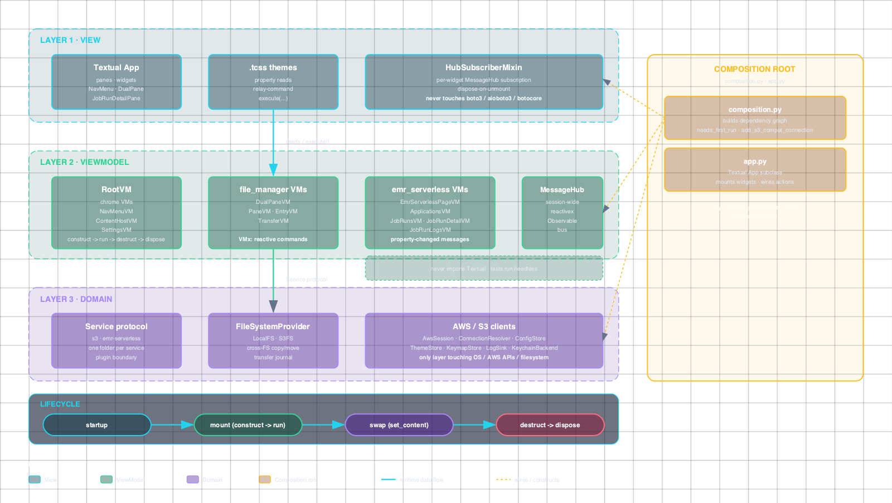

# 1. Architecture



> Human-readable mirror of §2 of [the design spec](superpowers/specs/2026-06-13-aws-tui-design.md).
> For the deep dive (VM tree, lifecycle invariants, capability matrix,
> end-to-end flows), read the spec.

aws-tui follows a five-layer architecture with enforced forbidden edges:

```
View (Textual)  →  ViewModel (VMx)  →  Service plugins  →  Domain ops  →  Infrastructure
```

`scripts/check-layers.sh` parses imports with `ast`, resolves relative
imports, and checks the banned edges in the script. `app.py` and
`composition.py` are trusted composition roots and are not scanned.
`services/` is a service-composition boundary: it can import concrete
VMs to build service pages, but it cannot import Textual widgets.

## 1.1. Layers
- **View** — Textual widgets and `.tcss` themes
  (`src/aws_tui/ui/`). Never touches `boto3`, `aioboto3`, or
  `botocore`. Talks to VMs via property reads + relay-command
  ``execute(...)``; subscribes to ``MessageHub`` for change
  notifications.
- **ViewModel** — VMx-based viewmodels with reactive commands and
  property-changed messages (`src/aws_tui/vm/`). Never imports
  Textual; tests run headless. Subtrees:
  - `vm/chrome/` — persistent shell state (hint legend, toasts,
    overlays like command palette / confirm / quick look / crash /
    resume / first-run, plus a retained `StatusBarVM` subscriber for
    legacy status bookkeeping even though no `StatusBar` widget is
    mounted in the production chrome).
  - `vm/file_manager/` — pane / dual-pane / entry / transfer VMs.
  - `vm/emr_serverless/` — `EmrServerlessPageVM` plus its
    `ApplicationsVM` / `JobRunsVM` / `JobRunDetailVM` / `JobRunLogsVM` children
    (added post-tag by PR #76 and extended by PR #84; the read-only EMR Serverless browser with logs streaming).
    `JobRunCloneVM` (PR #83) backs the clone-job-run modal — a
    sibling VM under `vm/emr_serverless/clone_vm.py`, instantiated
    per modal-mount with the focused run as the source.
  - `vm/settings/` — `SettingsVM` (built per-mount when the user
    selects the Settings nav peer) and `S3ConnectionsVM` (singleton
    on `AppContext`, drives the in-app Connections CRUD).
  - Top-level `vm/nav_menu_vm.py` — `NavMenuVM` (renamed from
    `ServicesMenuVM`; `RootVM.services_menu` is a legacy alias),
    `vm/content_host_vm.py`, `vm/root_vm.py`.
- **Service plugins** — One folder per top-level service
  (`src/aws_tui/services/`). v0.8.0 ships `s3` and
  `emr-serverless` (read-only browser + clone-job-run plus job-run
  logs — applications listing, job-runs master-detail, state-filter
  chips, clone-and-edit modal via `c`; cancel / vanilla submit are
  still deferred).
  Each service implements the `Service` protocol (declared in
  `vm/services_protocol.py`, re-exported from `services/__init__.py`).
- **Domain** — `FileSystemProvider` protocol with `LocalFS` and `S3FS`
  implementations + the cross-FS copy/move engine + the transfer
  journal (`src/aws_tui/domain/`). The Norton-Commander unifier; the
  pane VMs treat both sides as the same protocol.
- **Infrastructure** — `AwsSession`, `ConnectionResolver`,
  `ConfigStore`, `ThemeStore`, `KeymapStore`, `LogSink`, `CrashDump`,
  `KeychainBackend`. The only layer that touches the OS, AWS APIs,
  the file system, or the macOS keychain.

## 1.2. Composition root
The two top-level files `src/aws_tui/composition.py` and
`src/aws_tui/app.py` are the only modules permitted to import from
every layer. `composition.py` builds the dependency graph; `app.py`
is the Textual `App` subclass that mounts widgets and wires action
handlers.

`composition.py` also owns three startup-time helpers:

- `needs_first_run(...)` — true when neither config nor `~/.aws/`
  knows any connection (spec §6.4 Flow 5).
- `apply_resume_decision(...)` — deferred transfer-resume helper:
  applies a modal choice to journal entries and calls
  `AbortMultipartUpload` only when an entry carries an `upload_id`
  (the current production transfer path does not record MPU IDs).
- `add_s3_compat_connection(form)` — materializes the in-TUI
  S3-compatible form into a config-store entry.

## 1.3. Lifecycle
VMs implement `construct → run → destruct → dispose` (VMx convention).
The `RootVM` constructs the chrome and content-host children
depth-first; `ContentHostVM.set_content(new)` disposes the previous
content via the same cascade. App shutdown awaits the in-flight
transfers cancel + closes every aioboto3 client before disposing the
VM tree (spec §5.4).

## 1.4. Messaging
All cross-VM communication goes through the session's single
`MessageHub`. Custom envelopes (defined in
`src/aws_tui/vm/messages.py`):

- `ConnectionChangedMessage`, `ThemeChangedMessage`,
  `AuthExpiredMessage`, `TransferProgressMessage`,
  `KeymapChangedMessage`, `FocusChangedMessage`,
  `TransferCancelRequestedMessage`, `ConnectionListChangedMessage`.

VMs subscribe via `hub.messages.subscribe(on_next=callback)` (an
`reactivex.Observable` under the hood); filtering happens inside the
callback (typically `isinstance(msg, FooMessage)`). The view layer
subscribes via `HubSubscriberMixin` on a per-widget basis, which wraps
the same observable plus dispose-on-unmount.

## 1.5. Testing pyramid
| Tier | Count | What it proves |
|---|---|---|
| Unit | Recount with `uv run pytest tests/unit --collect-only -q | tail -1` | VM, domain, infra behavior; no I/O |
| Snapshot | Recount with `find tests/snapshot/__snapshots__ -name '*.raw' | wc -l` | View rendering against golden SVGs per theme × screen-state combination, plus paired content-presence guards (per PR #53 lesson) |
| Integration (in-process) | Recount with `uv run pytest tests/integration --collect-only -q | tail -1` | Full-app smoke + regression flows (app pilot, modal forwarding, multi-select, source swap, settings nav-page toggle, expired-SSO probe, etc.) |
| E2E | Recount with `uv run pytest tests/e2e --collect-only -q | tail -1` | Pilot-driven user journeys |
| Integration (MinIO) | Recount with `uv run pytest -m integration --collect-only -q | tail -1` | MinIO via testcontainers (opt-in, `-m integration`) |

Default tier total drifts with each post-tag PR. Recount with
`uv run pytest --collect-only -q | tail -1`; recount snapshot goldens
with `find tests/snapshot/__snapshots__ -name '*.raw' | wc -l`.
Opt-in MinIO tier: `uv run pytest -m integration`.

Run the default tiers (unit + snapshot + e2e + in-process integration)
with `uv run pytest`. Opt into the MinIO tier with
`uv run pytest -m integration` — it spins up a container, which the
default `addopts` filter excludes (`-m 'not integration'`).

## 1.6. Layer-rule check
`scripts/check-layers.sh` parses Python imports with `ast` across the
five layer subtrees, resolves relative imports to absolute module names,
and matches them against the banned-import rules inlined in the script.
The composition root and `app.py` are deliberately excluded — they live
at `src/aws_tui/` top-level so the check never inspects them.

## 1.7. Where to start reading the code
1. `src/aws_tui/composition.py` — see how everything wires.
2. `src/aws_tui/vm/root_vm.py` — top of the VM tree.
3. `src/aws_tui/vm/file_manager/dual_pane_vm.py` — the first concrete
   page VM (S3 service hosts it).
   `src/aws_tui/vm/emr_serverless/page_vm.py::EmrServerlessPageVM` —
   the second concrete page VM (post-tag, PR #76); a richer pattern
   that orchestrates three child VMs (`ApplicationsVM`,
   `JobRunsVM`, `JobRunDetailVM`) and runs three independent
   pollers.
4. `src/aws_tui/services/s3/service.py` — the first concrete service
   in v0.7.0; pattern for future ones.
   `src/aws_tui/services/emr_serverless/service.py` — the second
   shipped service (post-tag), using the richer per-service
   subtree pattern (dedicated domain client + VM subtree + UI
   widget tree).
5. `src/aws_tui/domain/cross_fs.py` — the engine that moves bytes
   between any pair of `FileSystemProvider`s.
6. `src/aws_tui/ui/widgets/` — pure Textual widgets; per-VM smoke
   tests in `tests/unit/ui/`.
7. `src/aws_tui/vm/nav_menu_vm.py` + `src/aws_tui/ui/widgets/nav_menu.py` —
   the left-rail nav: services list on top, Settings docked at the
   bottom (split into two `OptionList`s in the widget).
8. `src/aws_tui/vm/settings/settings_vm.py` +
   `src/aws_tui/ui/widgets/settings_view.py` — the in-app Settings
   page (built per-mount, not as an `AppContext` singleton — see the
   PR #56 post-ship amendment in the
   [Settings-as-nav-page design spec](superpowers/specs/2026-06-20-settings-as-first-class-nav-page-design.md)).
