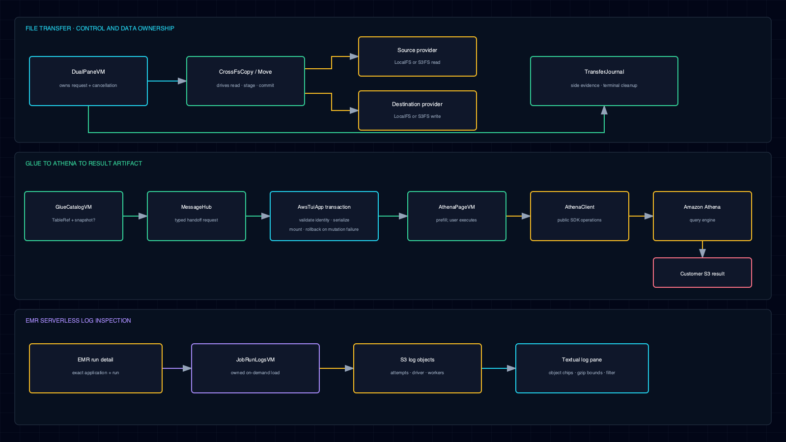
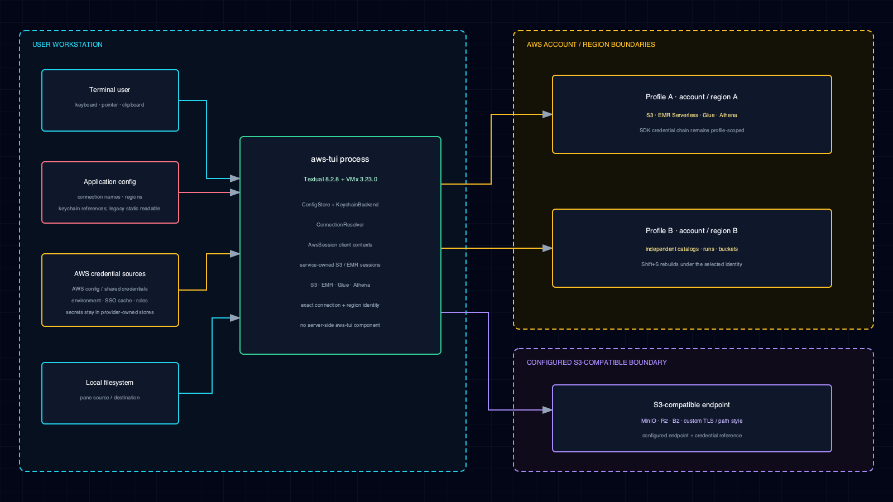
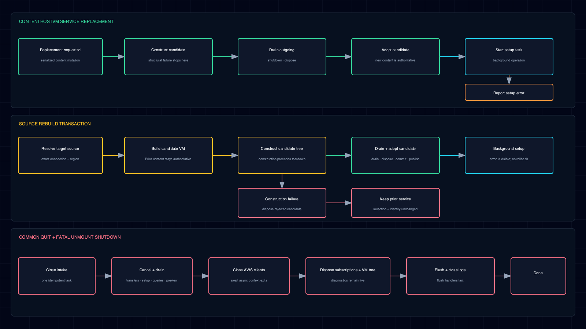

# 1. Architecture








aws-tui follows a five-layer architecture with enforced forbidden edges:

```
View (Textual)  →  ViewModel (VMx)  →  Service plugins  →  Domain ops  →  Infrastructure
```

`scripts/check-layers.sh` parses imports with `ast`, resolves relative
imports, and checks the banned edges in the script. `app.py` and
`composition.py` are trusted composition roots and are not scanned.
`services/` is a service-composition boundary: it can import concrete
VMs to build service pages, but it cannot import Textual widgets.

## 1.1. Layers
- **View** — Textual widgets and `.tcss` themes
  (`src/aws_tui/ui/`). Never touches `boto3`, `aioboto3`, or
  `botocore`. Talks to VMs via property reads + relay-command
  ``execute(...)``; subscribes to ``MessageHub`` for change
  notifications. The S3 root is the code-backed `DualPane` from
  `src/aws_tui/ui/widgets/dual_pane.py`, mounted through
  `src/aws_tui/ui/widgets/service_view_factory.py`; there is no `S3Page` class.
  `ContextPicker` provides bordered keyboard-focusable context selection, and
  EMR's specialized `ApplicationPicker` preserves its Rich application-state
  rendering. Both compose the shared `OverlayOptionList`: the trigger keeps its
  compact footprint while the choices use Textual's screen overlay, so opening
  or closing a picker does not resize adjacent regions. Overlay geometry and
  dismissal remain view state rather than entering VMx. `ServiceTabStrip`
  renders a persistent segmented frame while providing one predictable focus
  stop for service-local views.
- **ViewModel** — VMx-based viewmodels with reactive commands and
  property-changed messages (`src/aws_tui/vm/`). Never imports
  Textual; tests run headless. `ServiceSelectionStore` is a VM-layer type in
  `src/aws_tui/vm/service_source_vm.py`, shared by the single-context service
  VMs rather than owned by Infrastructure. Subtrees:
  - `vm/chrome/` — persistent shell state (hint legend, toasts,
    and overlays like command palette / confirm / quick look / crash).
    Transfer journals are diagnostic-only; no startup recovery VM or UI ships.
    `HintLegendVM` owns service-scoped action
    membership, configured shortcut labels, complete effect/prerequisite
    tooltips, availability, and fitting priority. The `HintLegend` view performs
    terminal-width measurement and renders exactly one compact command row;
    lower-priority hints yield to `[:] more` and `[q] quit` rather than wrapping.
  - `vm/file_manager/` — `DualPaneVM`, two `PaneVM` children, entry VMs, and
    transfer state. `DualPaneVM` owns cross-provider copy/move orchestration;
    each `PaneVM` owns one provider-backed projection and cursor.
  - `vm/table_clipboard_vm.py` — `TableClipboardVM`, an app-lifetime VMx
    component that retains one typed, replaceable table reference.
  - `vm/emr_serverless/` — `EmrServerlessPageVM` plus its
    `ApplicationsVM` / `JobRunsVM` / `JobRunDetailVM` / `JobRunLogsVM` children
    (the read-mostly EMR Serverless browser with logs streaming and focused
    clone submission).
    Its immutable `ServiceSourceContext` carries the active connection name,
    optional distinct AWS profile, and region to the service view; the shared
    `ServiceSourceHeader` renders that identity above the EMR application picker.
    `ServiceSelectionStore` scopes remembered service selections by
    `(service_id, connection_name, region)`.
    `JobRunCloneVM` backs the clone-job-run modal — a
    sibling VM under `vm/emr_serverless/clone_vm.py`, instantiated
    per modal-mount with the focused run as the source.
  - `vm/glue/` — `GluePageVM` with independent Catalog, Jobs, and
    Crawlers child VMs. `GlueCatalogVM` owns a `GlueIcebergVM` child that
    appears only for tables classified as Iceberg and loads Snapshots,
    History, Manifests, Files, Partitions, and References independently.
    The page shares `ServiceSourceContext` and
    connection/region-scoped selection memory with the other
    single-context AWS services. `GluePageVM` owns page-scoped table and snapshot
    handoff capability checks. `GlueCatalogVM` publishes immutable,
    service-neutral `OpenS3LocationRequest` and table `OpenAthenaTableRequest`
    messages from the selected table; `GlueIcebergVM` publishes snapshot
    `OpenAthenaTableRequest` messages from the visible snapshot. They never mount
    a Textual view or construct a destination service themselves.
  - `vm/athena/` — `AthenaPageVM` with Query, History, Results, and Saved
    child VMs. Its context and remembered selections are scoped by connection
    name and region; changing workgroup, catalog, or database invalidates the
    query context. Query work stays in the VM layer, while `domain/athena.py`
    owns boto mapping and `domain/sql_policy.py` fails closed before dispatch.
    `AthenaPageVM.open_table(...)` sets exact catalog/database context and
    prefills bounded starter SQL. `open_table_in_glue()` publishes
    `OpenGlueTableRequest` only when the current SQL resolves to one visible
    table.
  - `vm/settings/` — `SettingsVM` (built per-mount when the user
    selects the Settings nav peer) and `S3ConnectionsVM` (singleton
    on `AppContext`, drives the in-app Connections CRUD).
  - Top-level `vm/nav_menu_vm.py` — `NavMenuVM` (renamed from
    `ServicesMenuVM`; `RootVM.services_menu` is a legacy alias),
    `vm/content_host_vm.py`, `vm/root_vm.py`.
- **Service plugins** — One folder per top-level service
  (`src/aws_tui/services/`). The current tree ships `s3`,
  `emr-serverless` (read-only browser + clone-job-run plus job-run
  logs — applications listing, job-runs master-detail, state-filter
  chips, clone-and-edit modal via `c`; cancel / vanilla submit are
  still deferred), `glue` (read-only Catalog, Jobs, and Crawlers), and
  `athena` (read-only query, history, results, and saved-query views).
  `GlueService` composes both `GlueClient` and an Athena-backed
  `IcebergInspector`; `AthenaService` composes the query page.
  Each service implements the `Service` protocol (declared in
  `vm/services_protocol.py`, re-exported from `services/__init__.py`).
- **Domain** — `FileSystemProvider` protocol with `LocalFS` and `S3FS`
  implementations + the cross-FS copy/move engine + the transfer
  journal (`src/aws_tui/domain/`). The Norton-Commander unifier; the
  pane VMs treat both sides as the same protocol. Domain adapters perform the
  runtime AWS and filesystem I/O: `LocalFS` and `TransferJournal` access host
  storage, while `S3FS`, `EmrServerlessClient`, `GlueClient`, and
  `AthenaClient` issue service operations and map external responses/errors
  into domain values. `TableRef` and `QueryContext` carry immutable table and
  execution identity. `IcebergInspector` uses `AthenaQueryRunner` to read
  bounded Iceberg metadata tables; Athena history hydrates each bounded page
  with one batch request. `ReadOnlySqlPolicy` validates both user and generated
  SQL. Raw AWS responses remain below VMs.
- **Infrastructure** — Infrastructure owns sessions, credentials,
  configuration, SDK client construction, and OS-backed stores.
  `AwsSession` and `ConnectionResolver` provide configured AWS identities and
  client contexts to the domain adapters. Resolver order drives `Shift+S`;
  the VM-layer `ServiceSelectionStore` scopes workgroup and resource
  selections by service, connection name, and region. `ConfigStore`, `ThemeStore`,
  `KeymapStore`, `LogSink`, `CrashDump`, and `KeychainBackend` persist
  application and platform state. `ConfigStore` and Settings share endpoint
  and credential-source validation for S3-compatible connections.
  Infrastructure prepares those boundaries; domain adapters perform the
  provider operations.

`demo/` is a composition-only provider substitution outside the production
layers. Demo mode selects in-memory service adapters at the composition root;
production modules do not import the demo package.

## 1.2. Composition root
The two top-level files `src/aws_tui/composition.py` and
`src/aws_tui/app.py` are the only modules permitted to import from
every layer. `composition.py` builds the dependency graph; `app.py`
is the Textual `App` subclass that mounts widgets and wires action
handlers.

`composition.py` also constructs the app-lifetime `TableClipboardVM`. `app.py` owns the
best-effort OS clipboard copy after it receives the typed request; the VM
remains the authoritative in-app clipboard. `ActionRegistry` is also rooted in
`app.py`: `Shift+Q`, `Shift+V`, command-palette entries, and the Iceberg arrow
button dispatch the same registered Glue actions before the Glue VMs publish a
single typed Athena request path.

`AwsTuiApp` remains a large composition-root adapter that coordinates navigation,
cross-service rollback, action routing, and shutdown. Extracting those transaction
coordinators into dedicated mediators is deferred to a focused architecture change:
the move spans cancellation ownership and complete rollback state across all four
services, so treating it as a mechanical maintenance refactor would carry more risk
than the line-count reduction justifies.

At startup, automatic connection attempts consume one shared 90-second budget;
untried sources remain available for explicit selection after the local fallback
mounts.

## 1.3. Lifecycle
VMx components implement `construct → destruct → dispose`. Hosted service VMs
may additionally expose app-owned asynchronous `setup` and `shutdown` hooks;
those hooks are not a VMx lifecycle phase.
The `RootVM` constructs the chrome and content-host children
depth-first; `ContentHostVM.set_content(new)` disposes the previous
content via the same cascade. When outgoing content exposes `shutdown`,
`ContentHostVM.set_content(...)` awaits it before calling `dispose`; hosted VM
shutdown is awaited before disposal, and the host owns disposal of a candidate
that is never adopted. Every hosted service's owned operations drain before
teardown. App shutdown is task-owned and idempotent. Explicit quit and Textual
unmount (including fatal teardown) await the same sequence: stop navigation
intake, drain transfers, setup, queries, and preview workers, close every
aioboto3 client, dispose subscriptions and the VM tree, then flush and close
logs last so teardown diagnostics remain available
(spec §5.4).

## 1.4. Messaging
Cross-service and shell-wide event communication goes through the session's
single `MessageHub`. Parent VMs orchestrate their owned children directly when
the interaction stays inside one subtree. Custom envelopes (defined in
`src/aws_tui/vm/messages.py`):

- `ConnectionChangedMessage`, `ThemeChangedMessage`,
  `TransferProgressMessage`, `FocusChangedMessage`, `PaletteActionFailedMessage`,
  `TransferCancelRequestedMessage`, `ConnectionListChangedMessage`,
  `OpenS3LocationRequest`, `OpenAthenaTableRequest`,
  `OpenGlueTableRequest`, `CopyTableReferenceRequest`, and
  `ServiceOperationFailedMessage`. Recovered service exceptions use the last
  envelope to reach `RootVM`'s redacted durable-log boundary without coupling
  service VMs to logging infrastructure.

Cross-service navigation stays service-neutral. `OpenAthenaTableRequest` and
`OpenGlueTableRequest` carry a `TableRef` containing catalog, database, table,
connection name, and region; the Athena request may add a validated snapshot
ID. `app.py` serializes table handoffs, resolves the exact connection, rejects
region drift, snapshots the outgoing Glue/Athena state for rollback, and
mounts the destination through `RootVM`. A table request prefills the exact
bounded `SELECT * FROM "catalog"."database"."table" LIMIT 100`; a snapshot
request adds `FOR VERSION AS OF <snapshot-id>` before the limit. Athena receives
that generated SQL in the editor but does not execute it. For S3,
`OpenS3LocationRequest` carries the
exact connection, region, URI, pane, and reveal-object intent. The Results VM
reloads an execution and publishes only when it succeeded, belongs to the
active context, and has a valid `s3://` output location. Missing, malformed,
ambiguous, or stale identities stop at an advisory; VMs never import UI code.
`CopyTableReferenceRequest` carries one exact `TableRef` to the composition
root, which updates `TableClipboardVM` and attempts the OS clipboard copy.
Palette eligibility is VM-owned state: the palette projects global commands
and only commands whose declared service IDs include the active service.

VMs subscribe via `hub.messages.subscribe(on_next=callback)` (an
`reactivex.Observable` under the hood); filtering happens inside the
callback (typically `isinstance(msg, FooMessage)`). The view layer
subscribes via `HubSubscriberMixin` on a per-widget basis, which wraps
the same observable plus dispose-on-unmount.

## 1.5. Testing pyramid
| Tier | Count | What it proves |
|---|---|---|
| Unit | Recount with `uv run pytest tests/unit --collect-only -q | tail -1` | VM, domain, infra behavior; isolated local I/O only, with no external services |
| Snapshot | Recount with `find tests/snapshot/__snapshots__ -name '*.raw' | wc -l` | View rendering against golden SVGs per theme × screen-state combination, plus paired content-presence guards that reject blank-but-valid output |
| Integration (in-process) | Recount with `uv run pytest tests/integration --collect-only -q | tail -1` | Full-app smoke + regression flows (app pilot, modal forwarding, multi-select, source swap, settings nav-page toggle, expired-SSO probe, etc.) |
| E2E | Recount with `uv run pytest tests/e2e --collect-only -q | tail -1` | Pilot-driven user journeys |
| Integration (S3-compatible) | Recount with `uv run pytest -m integration --collect-only -q | tail -1` | Adobe S3Mock via testcontainers (opt-in, `-m integration`) |

The default tier total changes as coverage grows. Recount with
`uv run pytest --collect-only -q | tail -1`; recount snapshot goldens
with `find tests/snapshot/__snapshots__ -name '*.raw' | wc -l`.
Opt-in S3-compatible tier: `uv run pytest -m integration`.

Run the default tiers (unit + snapshot + e2e + in-process integration)
with `uv run pytest`. Opt into the S3-compatible tier with
`uv run pytest -m integration` — it spins up a container, which the
default `addopts` filter excludes (`-m 'not integration'`).

## 1.6. Layer-rule check
`scripts/check-layers.sh` parses Python imports with `ast` across the
five layer subtrees, resolves relative imports to absolute module names,
and matches them against the banned-import rules inlined in the script.
The composition root and `app.py` are deliberately excluded — they live
at `src/aws_tui/` top-level so the check never inspects them.

## 1.7. Where to start reading the code
1. `src/aws_tui/composition.py` — see how everything wires.
2. `src/aws_tui/vm/root_vm.py` — top of the VM tree.
3. `src/aws_tui/vm/file_manager/dual_pane_vm.py` — the first concrete
   page VM (S3 service hosts it).
   `src/aws_tui/vm/emr_serverless/page_vm.py::EmrServerlessPageVM` —
   another concrete page VM; a richer pattern
   that orchestrates four child VMs (`ApplicationsVM`,
   `JobRunsVM`, `JobRunDetailVM`, `JobRunLogsVM`) and runs three independent
   pollers.
4. `src/aws_tui/services/s3/service.py` — the first concrete service
   in v0.7.0; pattern for future ones.
   `src/aws_tui/services/emr_serverless/service.py` uses the richer per-service
   subtree pattern (dedicated domain client + VM subtree + UI
   widget tree).
   `src/aws_tui/services/glue/service.py` follows the same factory
   lifecycle for an AWS-only, read-only three-view page and retains
   validated selection identifiers per connection name and region.
   S3 owns independent sources for each pane, while single-context AWS services
   use `RootVM`'s active connection and are rebuilt as a whole when their source
   changes.
   `src/aws_tui/services/athena/service.py` is the corresponding query-service
   reference: it composes an Athena client, read-only SQL policy, and a fresh
   `AthenaPageVM` per AWS connection. Glue composes its own contextual Athena
   client for `IcebergInspector`; it does not reuse the mounted Athena VM.
5. `src/aws_tui/domain/cross_fs.py` — the engine that moves bytes
   between any pair of `FileSystemProvider`s.
6. `src/aws_tui/ui/widgets/` — pure Textual widgets; per-VM smoke
   tests in `tests/unit/ui/`.
7. `src/aws_tui/vm/nav_menu_vm.py` + `src/aws_tui/ui/widgets/nav_menu.py` —
   the left-rail nav: services list on top, Settings docked at the
   bottom (split into two `OptionList`s in the widget).
8. `src/aws_tui/vm/settings/settings_vm.py` +
   `src/aws_tui/ui/widgets/settings_view.py` — the in-app Settings
   page (built per-mount, not as an `AppContext` singleton — see the
   lifecycle amendment in the
   [Settings-as-nav-page design spec](superpowers/specs/2026-06-20-settings-as-first-class-nav-page-design.md)).
