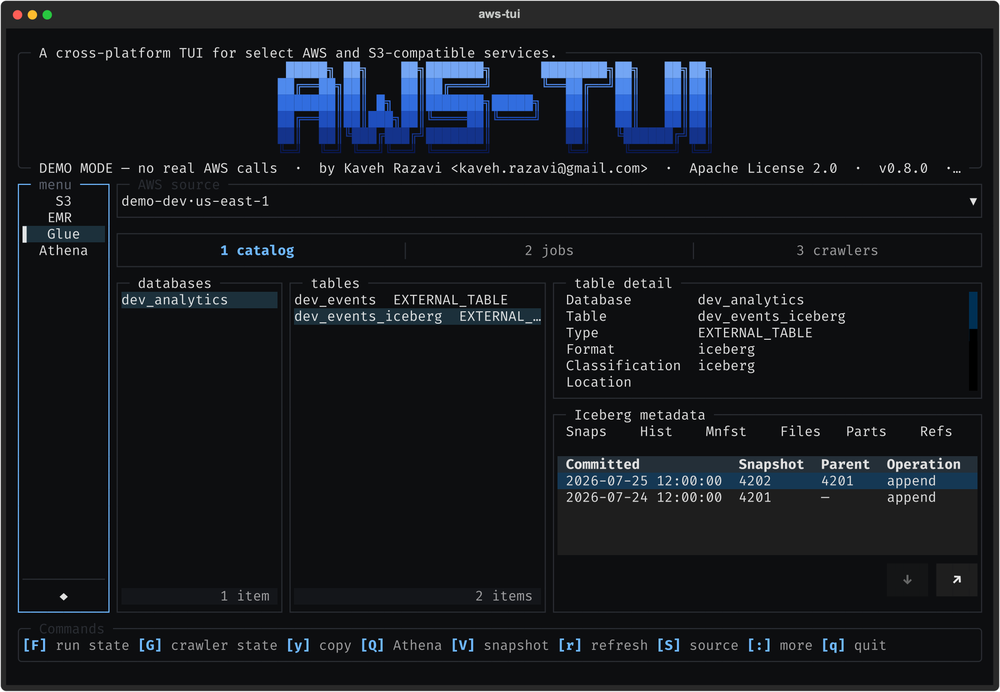

# 1. aws-tui

  

Cross-platform TUI for AWS and S3-compatible services — runs on macOS,
Linux, and Windows. Powered by
[Textual](https://textual.textualize.io/) and the
[VMx](https://github.com/thekaveh/VMx) MVVM framework.

The application combines a Norton-Commander-style S3 file manager, an EMR
Serverless console, and Unreleased AWS Glue, Amazon Athena, and Iceberg
inspection workflows.

## 1.1. What it does

- **Dual-pane S3 ⇄ local file management** — copy, delete, and multi-select
  across an S3 (or S3-compatible) source and your local filesystem.
- **One-key source switching** across every configured AWS profile and
  S3-compatible connection.
- **EMR Serverless console** — application picker, job-runs master-detail
  with state-filter chips, and on-demand log streaming with a grep filter.
- **AWS Glue read-only operations console** — Catalog, Jobs, and Crawlers
  views with an exact-source bordered picker, bordered job/crawler state
  selectors, and a typed copied-table reference.
- **Amazon Athena read-only query console** — Query, History, Results, and
  Saved views with fail-closed SQL validation, app-owned cancellation,
  paginated rows, exact-profile customer-S3 result handoff, keyboard-focusable
  context selectors, and same-source copied-table insertion without execution.
- **Integrated Iceberg operations** — bounded metadata views in Glue,
  generated Glue → Athena table and snapshot queries with explicit execution,
  Athena → Glue navigation for one unambiguous table, and S3 artifact handoff.
- **Themable, keyboard-driven** — built-in themes and fully customizable
  keybindings; valid overlays apply on the next launch while invalid overlays
  fall back atomically. The command palette shows service commands only for
  the active service.

Glue, Athena, and Iceberg integration are Unreleased minor-version feature
work targeting v0.9.0. They remain read-only: generated SQL is placed in the
Athena editor for review and never executes automatically.

## 1.2. Where to start

- New here? Start with **Installation**, then **Platforms** and
  **Connections**.
- Daily use: **Keybindings**, the **Cookbook**, and **Theming**.
- Service behavior: **S3 and Local File Manager**, **EMR Serverless**,
  **AWS Glue and Iceberg Metadata**, and **Amazon Athena**.
- Contributing or extending: **Architecture**, **Adding a Service**, and
  the **Contract Ledger**.
